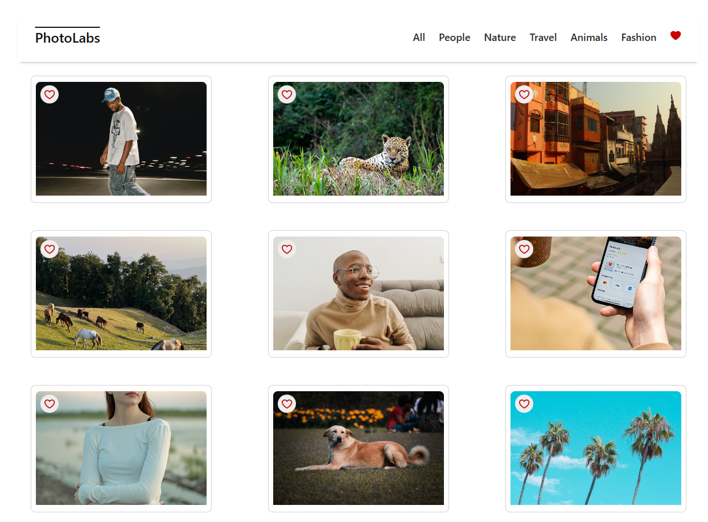

# react-photolabs
The PhotoLabs project for the Web Development React course programming.

# Photolabs



## Setup

Install dependencies with `npm install` in each respective `/frontend` and `/backend`.

## [Frontend] Running Webpack Development Server

```sh
cd frontend
npm install
npm start
```

## [Backend] Running Backend Server

Please read through [`backend/README.md`](/backend/README.md) for further setup details before starting the backend project, involving:
* setting up the appropriate .env file for database access
* seeding the database.

```sh
cd backend
npm install
npm start
```

&nbsp;

>Student's note: Be advised that by default, the frontend and backend projects will run in these respective ports: 3000 and 8001. The backend project will run on port 8001 (if no port is specified on the .env file), however, the frontend project, for development purposes, has a "proxy" entry on its [package.json](./frontend/package.json) file that ***will need*** manually updating if you choose to run the backend project on a different port.